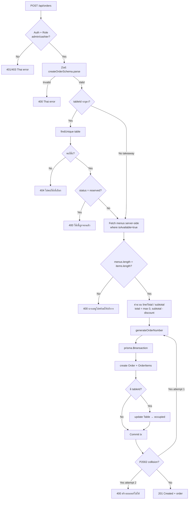
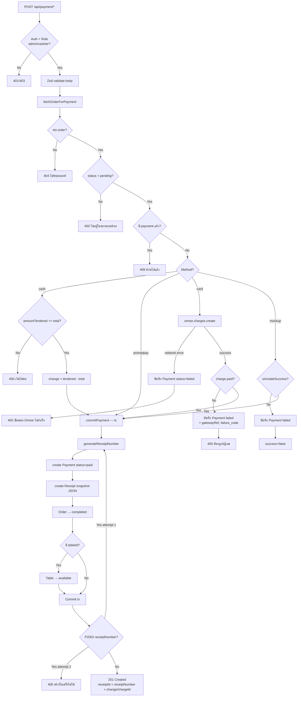
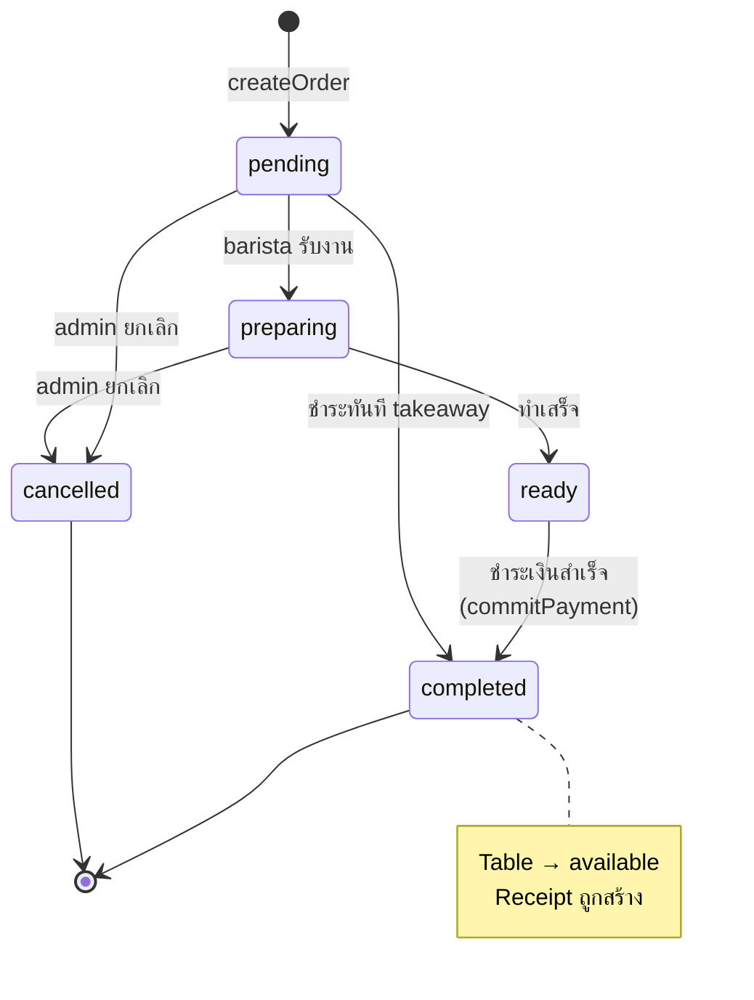

# Flow Diagrams — Cafe POS

Mermaid flowcharts สะท้อน logic จริงในโค้ด — อ้างอิงจาก [order.service.ts](../src/lib/services/order.service.ts) และ [payment.service.ts](../src/lib/services/payment.service.ts)

---

## 1. Create Order Flow

---

## 2. Payment Flow (รวม 4 channels: cash / promptpay / card / mockup)

---

## 3. Order Status Lifecycle

---

## Design Notes

- **Server-side price fetching** — กัน price tampering จาก client
- **Transaction atomicity** — `Order + OrderItems + Table` และ `Payment + Receipt + Order + Table` อยู่ใน tx เดียว
- **Retry on P2002** — unique collision ของ `orderNumber` / `receiptNumber` retry 1 ครั้ง
- **Failed payment persistence** — card flow บันทึก failed record ทุกเคส (network / declined) เพื่อ audit trail
